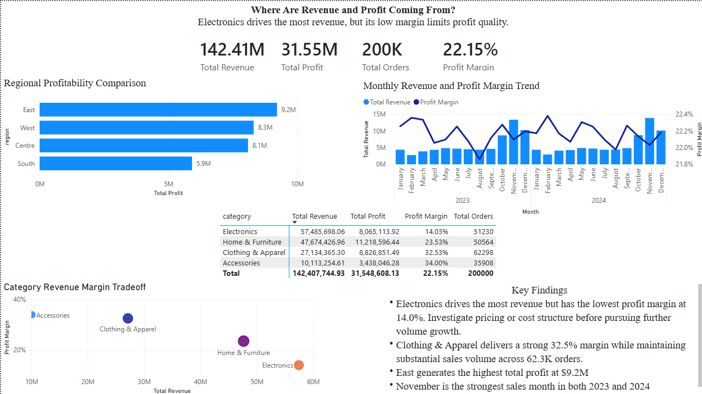

# ETL Pipeline with Anomaly Detection, Data Analysis & Visualization

An end-to-end ETL pipeline that ingests raw product sales data, cleans and transforms it, flags anomalous orders using machine learning, and loads the result into PostgreSQL for downstream analysis in Power BI.

## Overview

This project simulates a real-world sales data pipeline:

1. **Ingest** — pull the raw dataset from Kaggle
2. **Extract** — read and standardize the raw CSV
3. **Transform** — clean, type-cast, deduplicate, and engineer features
4. **Detect** — flag anomalous orders with an Isolation Forest model
5. **Load** — upsert the cleaned, scored data into PostgreSQL
6. **Analyze** — run the queries in `Analysis.sql` against the loaded data to answer business questions
7. **Visualize** — explore trends and flagged anomalies in a Power BI dashboard

## Tech Stack

- **Python** — pandas, NumPy, scikit-learn, SQLAlchemy
- **PostgreSQL** — storage for the cleaned, scored dataset
- **Power BI** — dashboard and reporting layer
- **Kaggle API** — dataset ingestion

## Project Structure

```
.
├── ingest.ipynb          # Pulls the raw dataset from Kaggle into ./data
├── sales.py              # Main ETL script: extract, transform, load
├── ml_anomalies.py       # Isolation Forest anomaly detection
├── Analysis.sql          # SQL queries used for reporting/analysis
├── data/                 # Raw dataset (not tracked in git)
├── assets/
│   └── dashboard.png     # Power BI dashboard screenshot
├── .env.example          # Template for required environment variables
└── .gitignore
```

## Anomaly Detection Approach

`ml_anomalies.py` uses an **Isolation Forest** over a set of engineered features rather than raw values:

- Log-transformed quantity, unit price, revenue, and profit, so a handful of very large orders don't dominate the distance calculations
- A **revenue mismatch** feature comparing actual revenue to `quantity × unit_price`, since a large gap between the two is itself a signal of bad data or fraud
- Profit margin as an additional signal
- Anomaly scores are normalized against the 1st/99th percentile of the raw scores, so results stay on a stable 0–1 scale instead of being skewed by a few extreme outliers

The contamination rate (expected proportion of anomalies) is configurable via the `ANOMALY_CONTAMINATION` environment variable, defaulting to 1%.

## Setup

1. Clone the repo and install dependencies:
   ```bash
   pip install pandas numpy scikit-learn sqlalchemy python-dotenv kaggle psycopg2-binary
   ```
2. Copy `.env.example` to `.env` and fill in your PostgreSQL password:
   ```bash
   cp .env.example .env
   ```
3. Set up your Kaggle API credentials (`~/.kaggle/kaggle.json`) and run `ingest.ipynb` to download the dataset.
4. Run the pipeline:
   ```bash
   python sales.py
   ```

## Data Source

[Product Sales Dataset 2023–2024](https://www.kaggle.com/datasets/yashyennewar/product-sales-dataset-2023-2024) via Kaggle.

## SQL Analysis

[`Analysis.sql`](Analysis.sql) contains the queries run against the loaded `"Sales Orders"` table to answer core business questions:

- **Overall summary** — total orders, unique customers, units sold, revenue, profit, margin %, and average order value
- **Monthly trend** — orders, revenue, profit, and margin by month
- **Category performance** — revenue and margin by category, with a ranking of each on both dimensions
- **Regional breakdown** — revenue, profit, and margin by region

Example — overall summary query:

```sql
SELECT
    COUNT(*) AS total_orders,
    COUNT(DISTINCT customer_name) AS unique_customers,
    SUM(quantity) AS units_sold,
    ROUND(SUM(revenue)::numeric, 2) AS total_revenue,
    ROUND(SUM(profit)::numeric, 2) AS total_profit,
    ROUND((SUM(profit) / SUM(revenue) * 100)::numeric, 2) AS profit_margin_pct,
    ROUND((SUM(revenue) / COUNT(*))::numeric, 2) AS avg_order_value
FROM "Sales Orders";
```

## Dashboard

Cleaned and scored data is loaded into PostgreSQL and visualized in a Power BI dashboard covering sales trends, regional performance, and flagged anomalies.


